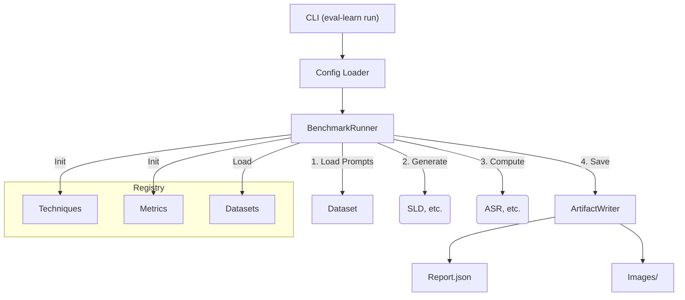

# Eval-Learn Developer Guide

## 1. Project Overview

**Eval-Learn** is a modular, extensible benchmarking framework for evaluating "unlearning" techniques in Text-to-Image models (like Stable Diffusion). 

### Purpose
To provide a standardized way to measure:
*   **Safety:** Can the model stop generating harmful content (e.g., Nudity)? (Metric: ASR)
*   **Utility:** Does the model still generate high-quality images? (Metric: FID, TIFA)
*   **Robustness:** Is the safety mechanism resistant to jailbreaks?

### Architecture
The project follows a **Registry-Plugin Architecture**. The core runner logic is generic and doesn't know about specific techniques or metrics. Instead, components are registered dynamically and instantiated via configuration files.



---

## 2. File & Folder Breakdown

The project is structured under `src/eval_learn/` to ensure it is installable as a standard Python package.

### Core Components
*   **`src/eval_learn/cli.py`**: The entry point for the command-line interface. Handles argument parsing and config loading.
*   **`src/eval_learn/types.py`**: Defines shared data structures (`Dataset`, `MetricResult`) to ensure type safety across modules.
*   **`src/eval_learn/logging_utils.py`**: Provides a standardized `get_logger()` function for consistent console output.

### Functional Modules
*   **`registry/`**: The heart of the plugin system.
    *   `local.py`: Contains decorators (`@register_technique`, etc.) and lookup functions.
    *   `entrypoints.py`: Handles discovery of third-party plugins installed via pip.
*   **`runners/`**: Orchestration logic.
    *   `benchmark_runner.py`: The main loop that connects Datasets, Techniques, and Metrics. It generates images and computes scores.
*   **`configs/`**: Configuration management.
    *   `base.py`: The `BaseConfig` class that all configs inherit from. Handles dictionary serialization.
*   **`artifacts/`**: Output handling.
    *   `writer.py`: Saves generated images and JSON reports to the filesystem in a structured way.

### Plugin Implementations
*   **`techniques/`**: Algorithms for image generation/unlearning.
    *   `sld/`: Safe Latent Diffusion implementation.
        *   `wrapper.py`: Adapts the Diffusers pipeline to our `Technique` interface.
        *   `config.py`: Configuration dataclass for SLD (e.g., `safety_concept`, `guidance_scale`).
*   **`metrics/`**: Scoring algorithms.
    *   `asr/`: Attack Success Rate.
        *   `metric.py`: Calculates score using NudeNet/Q16.
        *   `config.py`: Configuration for ASR (e.g., `use_nudenet`).
*   **`datasets/`**: Data loading logic.
    *   `i2p_csv.py`: Loads prompts from the I2P benchmark CSV file.

---

## 3. User Workflow

How a user interacts with the package to run a benchmark.

### Step 1: Install
```bash
pip install -e .[asr,diffusers]
```
*   Installs the package in editable mode with optional dependencies for ASR (NudeNet) and Diffusers.

### Step 2: Create Configuration
Create a YAML or JSON file (e.g., `my_run.json`) defining what to run.

```json
{
    "run_name": "My_First_Run",
    "output_dir": "results/",
    "dataset": {
        "name": "i2p_csv",
        "config": { "path": "data/i2p/i2p_benchmark_sample.csv", "limit": 10 }
    },
    "technique": {
        "name": "sld",
        "config": { "model_id": "AIML-TUDA/stable-diffusion-safe", "device": "cuda" }
    },
    "metric": {
        "name": "asr",
        "config": { "use_nudenet": true }
    }
}
```

### Step 3: Execute
```bash
eval-learn run --config my_run.json
```
*   **Outcome:** The system loads the dataset, generates images using SLD, checks them with ASR, and saves a report to `results/My_First_Run/`.

---

## 4. Developer Extension Guide

How to add new features without touching the core code.

### Extension Points
You can extend the system by adding new:
1.  **Datasets** (e.g., loading from HuggingFace Datasets)
2.  **Techniques** (e.g., ESD, UCE, or a new concept eraser)
3.  **Metrics** (e.g., CLIP Score, Aesthetics)

### Scenario: Adding a New Metric ("CLIP Score")

#### 1. Create Directory Structure
Create `src/eval_learn/metrics/clip_score/`.

#### 2. Define Configuration
Create `src/eval_learn/metrics/clip_score/config.py`:
```python
from dataclasses import dataclass
from ...configs.base import BaseConfig

@dataclass
class ClipScoreConfig(BaseConfig):
    model_name: str = "openai/clip-vit-base-patch32"
```

#### 3. Implement Logic & Register
Create `src/eval_learn/metrics/clip_score/metric.py`:
```python
from ...registry import register_metric
from ...types import MetricResult
from .config import ClipScoreConfig

@register_metric("clip_score")
class ClipScoreMetric:
    def __init__(self, **kwargs):
        self.config = ClipScoreConfig.from_dict(kwargs)
        # Load CLIP model here...

    def compute(self, images, prompts, metadata=None) -> MetricResult:
        # Calculate score...
        score = 0.85 
        return MetricResult(name="CLIP Score", value=score)
```

#### 4. Export
Update `src/eval_learn/metrics/__init__.py`:
```python
from .clip_score.metric import ClipScoreMetric
```

#### 5. Use It
Update your JSON config to use `"name": "clip_score"`.

### Testing Strategy
1.  **Smoke Test:** Create a test in `tests/` that mocks the heavy model calls (like `tests/test_smoke_asr_sld.py`) to verify the registry and config wiring work.
2.  **Unit Test:** Test the logic of your `compute` method in isolation.
3.  **Run:** `pytest tests/`

### Contribution Guidelines
1.  **Format:** Use strict type hints and dataclasses.
2.  **Log, Don't Print:** Always use `logger = get_logger(__name__)`.
3.  **Dependencies:** If your feature requires a heavy library (like `tensorflow`), wrap imports in `try/except` and raise a helpful error if missing.
